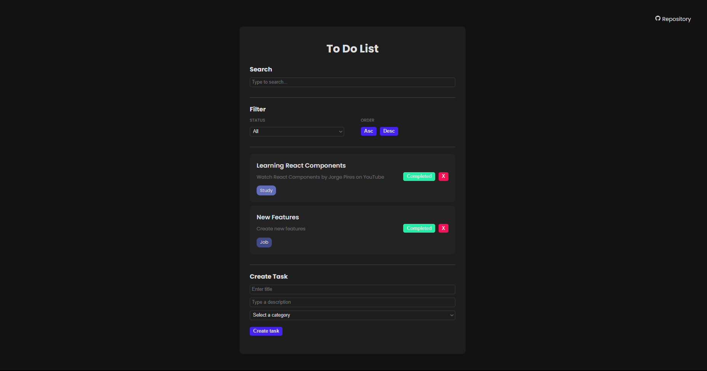

# To-Do List React

This is a React-based "To-Do List" project created for the purpose of learning and practicing web development concepts. This project was inspired by Matheus Battisti's tutorial, which you can find [here](https://github.com/matheusbattisti). You can also watch the tutorial video [here](https://www.youtube.com/watch?v=YVEVrigByKY).



## How to Run?

To run this project on your local machine, follow these steps:

### Prerequisites

You need to have [Node.js](https://nodejs.org/) installed on your system.

### Steps

1. Clone this repository to your local machine using the following command:

   ```
   git clone https://github.com/jorgeprj/todo-list-react.git
   ```

2. Navigate to the project directory:

   ```
   cd todo-list-react
   ```

3. Install the project's dependencies:

   ```
   npm install
   ```

4. Start the application:

   ```
   npm run dev
   ```

5. The application will be available in your browser at `http://localhost:3000`.

## Features

This "To-Do List" application includes the following features:

- Adding a new task with title, description, and category.
- Deleting existing tasks.
- Marking a task as completed.
- Filtering tasks by "Completed," "Incomplete," and "All."
- Sorting tasks in ascending and descending order.

## Acknowledgments

This project was developed based on Matheus Battisti's tutorial.I thank him for sharing his knowledge and learning resources.

## Contributions

If you'd like to contribute to this project, please feel free to open an issue or submit a pull request. We welcome improvements and suggestions.

## License

This project is licensed under the [MIT License](LICENSE).